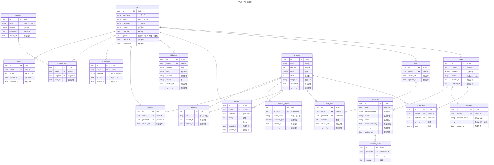

# setup
- Search `Markdown Preview Mermaid` and `Mermaid Markdown Syntax Highlighting` on VSCode.

```mermaid
---
title: "ECサイト ER図（拡張版）"
---
erDiagram
    users ||--o{ orders : ""
    users ||--o{ carts : ""
    users ||--o{ reviews : ""
    users ||--o{ addresses : ""
    users ||--o{ wishlists : ""
    users ||--o{ notifications : ""
    users ||--o{ coupons_users : ""
    users ||--o{ points : ""

    products ||--o{ order_items : ""
    products ||--o{ cart_items : ""
    products ||--o{ reviews : ""
    products ||--o{ categories : ""
    products ||--o{ product_options : ""
    products ||--o{ wishlists : ""

    orders ||--o{ order_items : ""
    orders ||--|{ payments : ""
    orders ||--|{ shipments : ""

    carts ||--o{ cart_items : ""

    categories ||--o{ products : ""

    shipments ||--|{ shipment_items : ""

    coupons ||--o{ coupons_users : ""

    users {
        uuid id PK "UUID"
        string userName "ユーザー名"
        string email "メールアドレス"
        string password "パスワード"
        string phone "電話番号"
        date birthdate "生年月日"
        int gender "性別 (0: 不明, 1: 男性, 2: 女性)"
        date created_at "作成日時"
        date updated_at "更新日時"
    }

    products {
        uuid id PK "UUID"
        string name "商品名"
        text description "商品説明"
        decimal price "価格"
        int stock "在庫数"
        string imageUrl "画像URL"
        date created_at "作成日時"
        date updated_at "更新日時"
    }

    product_options {
        uuid id PK "UUID"
        uuid productId FK "products.id"
        string option_name "オプション名"
        decimal additional_price "追加料金"
        date created_at "作成日時"
        date updated_at "更新日時"
    }

    orders {
        uuid id PK "UUID"
        uuid userId FK "users.id"
        decimal totalAmount "合計金額"
        string status "注文ステータス"
        date created_at "作成日時"
        date updated_at "更新日時"
    }

    order_items {
        uuid id PK "UUID"
        uuid orderId FK "orders.id"
        uuid productId FK "products.id"
        int quantity "数量"
        decimal price "価格"
    }

    payments {
        uuid id PK "UUID"
        uuid orderId FK "orders.id"
        string paymentMethod "支払い方法"
        string status "支払いステータス"
        date created_at "作成日時"
    }

    addresses {
        uuid id PK "UUID"
        uuid userId FK "users.id"
        string address "住所"
        string city "市区町村"
        string zipCode "郵便番号"
        string country "国"
        date created_at "作成日時"
        date updated_at "更新日時"
    }

    shipments {
        uuid id PK "UUID"
        uuid orderId FK "orders.id"
        string trackingNumber "追跡番号"
        string carrier "配送業者"
        string status "配送状況"
        date estimatedDelivery "到着予定日"
        date created_at "作成日時"
        date updated_at "更新日時"
    }

    shipment_items {
        uuid id PK "UUID"
        uuid shipmentId FK "shipments.id"
        uuid orderItemId FK "order_items.id"
        int quantity "数量"
    }

    carts {
        uuid id PK "UUID"
        uuid userId FK "users.id"
        date created_at "作成日時"
        date updated_at "更新日時"
    }

    cart_items {
        uuid id PK "UUID"
        uuid cartId FK "carts.id"
        uuid productId FK "products.id"
        int quantity "数量"
        date created_at "作成日時"
        date updated_at "更新日時"
    }

    reviews {
        uuid id PK "UUID"
        uuid userId FK "users.id"
        uuid productId FK "products.id"
        int rating "評価"
        text comment "コメント"
        date created_at "作成日時"
        date updated_at "更新日時"
    }

    categories {
        uuid id PK "UUID"
        string name "カテゴリ名"
        date created_at "作成日時"
        date updated_at "更新日時"
    }

    wishlists {
        uuid id PK "UUID"
        uuid userId FK "users.id"
        uuid productId FK "products.id"
        date created_at "作成日時"
    }

    notifications {
        uuid id PK "UUID"
        uuid userId FK "users.id"
        string message "通知メッセージ"
        bool is_read "既読フラグ"
        date created_at "作成日時"
    }

    coupons {
        uuid id PK "UUID"
        string code "クーポンコード"
        decimal discount "割引額"
        date expiry_date "有効期限"
        date created_at "作成日時"
    }

    coupons_users {
        uuid id PK "UUID"
        uuid userId FK "users.id"
        uuid couponId FK "coupons.id"
        date used_at "使用日時"
    }

    points {
        uuid id PK "UUID"
        uuid userId FK "users.id"
        int points "保有ポイント"
        date created_at "作成日時"
        date updated_at "更新日時"
    }

```